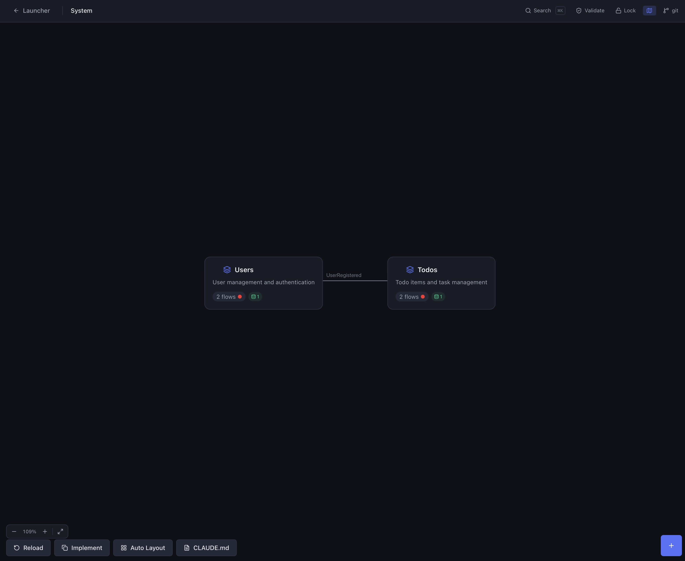
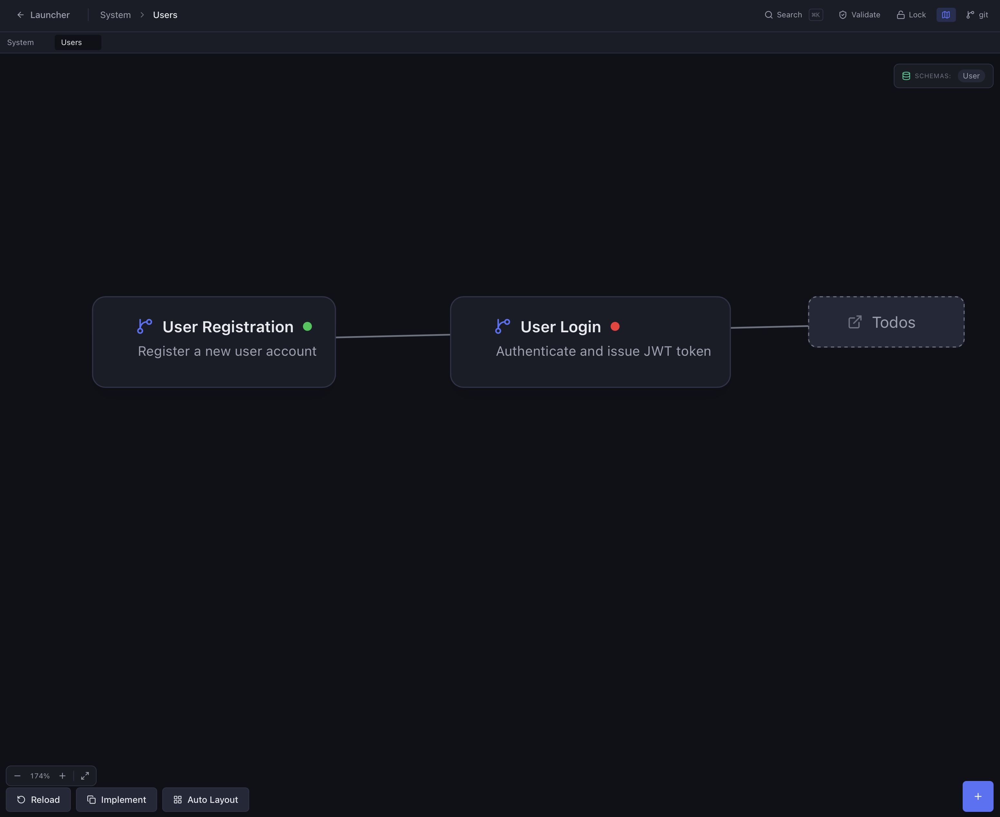
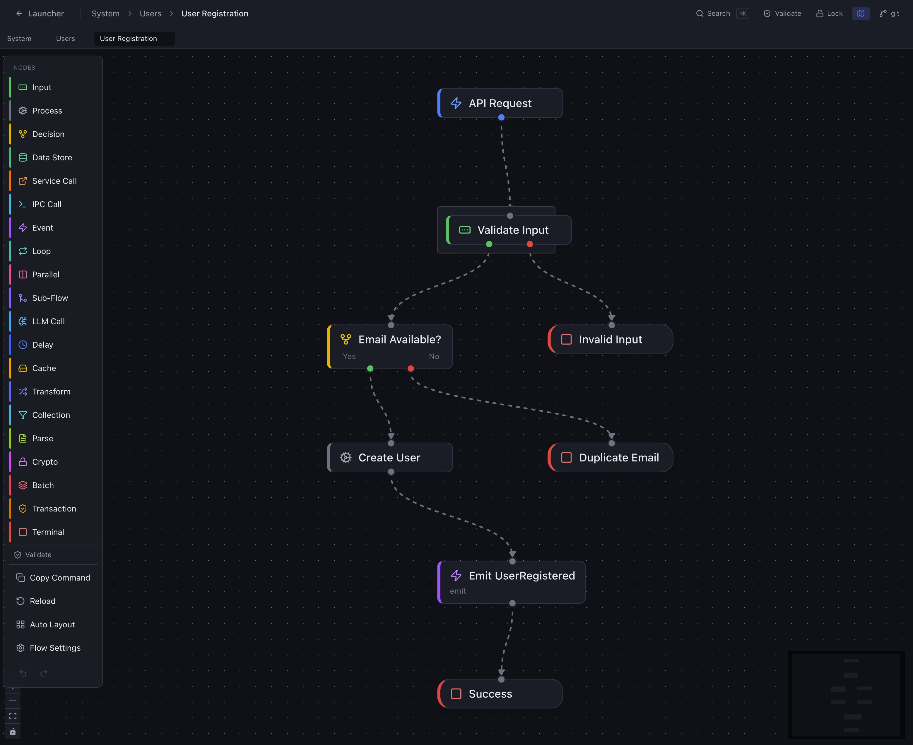

# Design Driven Development Tool

The desktop application for **[Design Driven Development](https://github.com/cybersoloss/DDD)** — design software visually as flow graphs, let AI implement from YAML specs.

> **Note:** The abbreviation "DDD" is used in command names and directory references throughout this project for brevity. This is not related to Eric Evans' Domain-Driven Design, which is an entirely separate methodology.

Built with Tauri 2.0 (Rust) + React 19 + TypeScript + Tailwind CSS v4.

[]() [](LICENSE)

## What It Does

The Design Driven Development Tool is a visual editor for designing software as flow diagrams. You draw flows on a canvas, the tool outputs YAML specs, and Claude Code generates working code from those specs.

**Three-level canvas navigation:**

| Level | View | What you see |
|-------|------|-------------|
| **L1 — System Map** | Bird's-eye view | All domains as cards, inter-domain event wiring |
| **L2 — Domain Map** | Domain detail | Flow blocks with drag positioning, connections, sync indicators |
| **L3 — Flow Canvas** | Flow editor | Full node graph with 28 node types, connections, spec panel |

**System Map** — domains and event wiring at a glance:



**Domain Map** — flows within a domain, with cross-domain references:



**Flow Canvas** — full node graph editor with 28 node types:



## Features

- **28 node types** — trigger, input, process, decision, terminal, data_store, service_call, ipc_call, event, loop, parallel, sub_flow, llm_call, delay, cache, transform, collection, parse, crypto, batch, transaction, agent_loop, guardrail, human_gate, orchestrator, smart_router, handoff, agent_group
- **Visual flow editor** — drag-and-drop nodes, connect with typed handles (valid/invalid, true/false, success/error, hit/miss, etc.)
- **YAML spec panel** — edit node specs directly alongside the canvas, changes sync both ways
- **Validation engine** — 20+ rules checking flow completeness, connection wiring, event matching, and spec correctness
- **Git integration** — branch display, staged/unstaged changes, commit from within the app
- **Bidirectional drift detection** — tracks spec-vs-code sync state (synced, spec_ahead, code_ahead, diverged)
- **Annotation tracking** — shows pending implementation wisdom captured by `/ddd-reflect`
- **Project lock** — prevent accidental edits with Cmd+Shift+L
- **Minimap** — overview navigation for large flow graphs
- **Search** — Cmd+K to find flows, domains, and nodes across the project
- **Undo/redo** — per-flow undo history with Cmd+Z / Cmd+Shift+Z
- **Auto-layout** — automatic node positioning for imported or messy flows
- **Context menus** — right-click on nodes, flows, and canvas for quick actions
- **Dark theme** — designed for extended use

## Prerequisites

- **Node.js** 20+
- **Rust** (latest stable) — [Install via rustup](https://rustup.rs/)
- **Platform-specific Tauri dependencies** — see the [Tauri v2 prerequisites guide](https://v2.tauri.app/start/prerequisites/)

### macOS

```bash
xcode-select --install
```

### Linux (Debian/Ubuntu)

```bash
sudo apt update
sudo apt install libwebkit2gtk-4.1-dev build-essential curl wget file \
  libssl-dev libgtk-3-dev libayatana-appindicator3-dev librsvg2-dev
```

### Windows

Install [Microsoft Visual Studio C++ Build Tools](https://visualstudio.microsoft.com/visual-cpp-build-tools/) and [WebView2](https://developer.microsoft.com/en-us/microsoft-edge/webview2/).

## Getting Started

> **No pre-built binaries yet.** This is alpha — you'll need to build from source. Packaged releases are planned.

> **New here?** Read **[GETTING-STARTED.md](GETTING-STARTED.md)** for a complete walkthrough — navigation, adding nodes, connecting flows, keyboard shortcuts, and more.

```bash
git clone https://github.com/cybersoloss/ddd-tool.git
cd ddd-tool
npm install
npm run tauri dev
```

The app opens at 1280x800. On first launch, use the Project Launcher to open or create a Design Driven Development project directory.

### Build for Production

```bash
npm run tauri build
```

The built app will be in `src-tauri/target/release/bundle/`.

## Project Structure

```
src/                              # React frontend
  components/
    SystemMap/                    # L1 — system overview with domain cards
    DomainMap/                    # L2 — domain map with draggable flow blocks
    FlowCanvas/                   # L3 — React Flow canvas
      nodes/                      # 28 node type components
    SpecPanel/                    # YAML spec editor sidebar
      editors/                    # Per-field editors (cross-cutting, spec fields)
    Validation/                   # Validation panel and badges
    GitPanel/                     # Git status, staging, commits
    Navigation/                   # Breadcrumb, search palette, toolbar
    ProjectLauncher/              # Project open/create/recent screen
    Settings/                     # App settings
  stores/                         # Zustand state management
    project-store.ts              # Project loading, domain configs
    flow-store.ts                 # Flow nodes, connections, editing
    sheet-store.ts                # Canvas navigation (L1/L2/L3)
    implementation-store.ts       # Mapping, drift detection, annotations
    validation-store.ts           # Validation rules and results
    git-store.ts                  # Git operations
    ui-store.ts                   # UI state (lock, minimap, search)
    undo-store.ts                 # Per-flow undo/redo history
    app-store.ts                  # App-level state (view, theme)
  types/                          # TypeScript type definitions
    flow.ts                       # 28 node types, specs, connections
    implementation.ts             # SyncState, FlowMapping, DriftInfo, Annotations
  utils/                          # Validators, auto-layout, helpers
src-tauri/                        # Rust backend
  src/lib.rs                      # Tauri commands: file I/O, git ops, file hashing, directory watching
tests/
  e2e/
    auto-test-runner.ts           # CLI runner: validates a DDD project, produces two YAML reports
```

## Testing

The tool includes a standalone CLI runner that validates a DDD project using the same TypeScript validation logic as the app — no Tauri required.

```bash
npm run test:specs -- /path/to/ddd-project
```

Produces two YAML reports in `<project>/.ddd/reports/`:

| Report | What it catches |
|--------|----------------|
| `tool-compatibility-report.yaml` | YAML parse failures, unknown node types, normalization crashes — "the tool broke" |
| `spec-quality-report.yaml` | Validation errors, broken references, event wiring issues, feature coverage — "the specs are wrong" |

The runner is part of the [DDD e2e test infrastructure](https://github.com/cybersoloss/DDD/tree/main/tests/e2e). The DDD repo ships a purpose-built example project ([Nexus](https://github.com/cybersoloss/DDD/tree/main/examples/nexus)) that exercises all 28 node types, 13 trigger types, and all other DDD features. After cloning the DDD repo, run:

```bash
npm run test:specs -- ~/dev/DDD/examples/nexus
```

Expected: `FULLY_COMPATIBLE`, 0 errors, 90+ quality score. Any regression here means a framework change broke the tool.

## How It Fits Together

```
You design flows          DDD Tool outputs        Claude Code reads specs
in DDD Tool          -->  YAML spec files    -->  and generates code
                          (specs/)                (/ddd-implement)
                               |                       |
                               v                       v
                          Code wisdom             Working code
                          feeds back              with tests
                          (/ddd-reflect)
```

The Design Driven Development Tool is Phase 2 (Design) of the [four-phase Design Driven Development lifecycle](https://github.com/cybersoloss/DDD#how-it-works). The full workflow:

1. **Create** — `/ddd-create` generates specs from a description
2. **Design** — Open specs in DDD Tool, visualize and refine on canvas
3. **Build** — `/ddd-scaffold` + `/ddd-implement` + `/ddd-test`
4. **Reflect** — `/ddd-sync` + `/ddd-reflect` + `/ddd-promote`

## Related Repos

| Repo | What |
|------|------|
| [Design Driven Development](https://github.com/cybersoloss/DDD) | Methodology docs, Usage Guide, spec format reference, templates |
| [claude-commands](https://github.com/cybersoloss/claude-commands) | Claude Code slash commands (`/ddd-create`, `/ddd-implement`, etc.) |

## Contributing

See [CONTRIBUTING.md](CONTRIBUTING.md) for development setup, guidelines, and how to submit changes.

## License

[MIT](LICENSE) — Copyright (c) 2025 Murat Hüseyin Candan

Significant portions of this software were developed with [Claude](https://claude.ai) (Anthropic).
